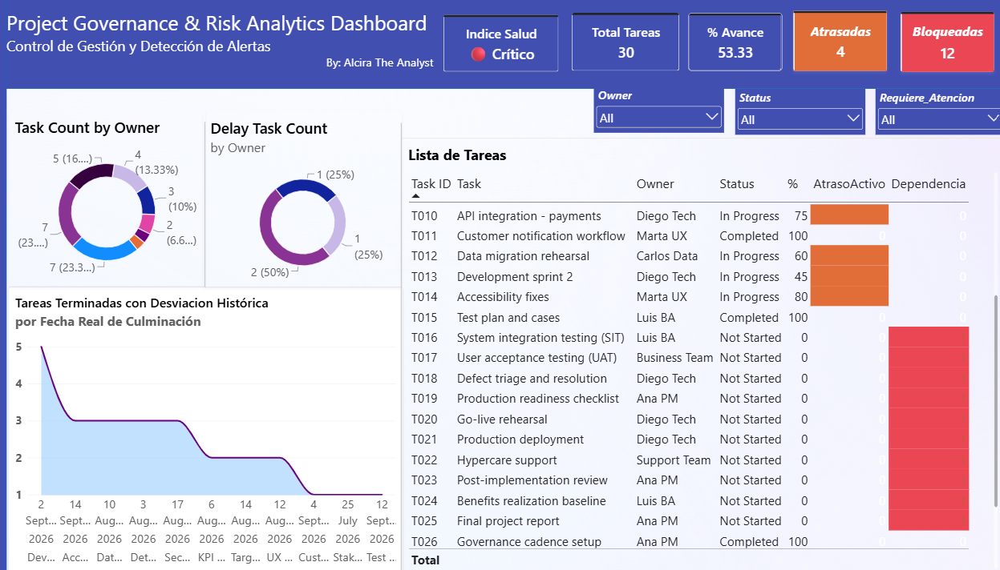

# 📊 Project Governance & Risk Analytics Dashboard

> **Diagnóstico prescriptivo de PMO, auditoría automatizada en Python e integración visual con Power BI & Generative AI**
> 
> **Por:** Alcira The Analyst  
> **Corte de Análisis:** 16 de Septiembre, 2026  

---

## 📸 Demostración del Dashboard Ejecutivo

*Figura 1. Vista principal del tablero de gobernanza con indicadores de salud del proyecto (KPIs), avance, desviación de tiempos y alertas de dependencias.*

---

## 📌 Contexto del Negocio y Problema de Gobernanza

En el marco de la ejecución del proyecto **Core System Upgrade & Digital Migration**, la Oficina de Gestión de Proyectos (PMO) requirió una evaluación integral del estado de la ruta crítica a un mes de la fecha meta de salida a producción (*Target Go-Live: 20-Oct-2026*).

### Principales Hallazgos y Riesgos Detectados:
* **Estrangulamiento en la Ruta Crítica:** La fase de *System Integration Testing (SIT)* no pudo iniciar por el retraso simultáneo en la integración de pagos (T010), el ensayo de migración de datos (T012) y el Sprint 2 de desarrollo (T013).
* **Efecto Cascada:** El 40% de la carga total del proyecto (12 tareas) se encuentra bloqueado en cadena por dependencias técnicas.
* **Calidad e Integridad de Datos:** Se detectaron incongruencias transaccionales en la herramienta de seguimiento (Tracker), como registros marcados en progreso con fechas de término reales ya pasadas.

---

## 🛠️ Arquitectura de la Solución Técnicamente Integrada

El proyecto combina un flujo de procesamiento *data-driven* desde el backend hasta la capa de visualización ejecutiva:

    ┌───────────────────────────────┐      ┌───────────────────────────────┐      ┌─────────────────────────────┐
    │    Archivos de Entrada        │ ───► │  Motor de Auditoría Python    │ ───► │   Generación de Reportes    │
    │ • Project_Management_Case.xlsx│      │  • Reglas de Negocio (Pandas) │      │ • Project_Tracker_Audited   │
    │ • Minutas de Comité           │      │  • Diagnóstico Gemini API     │      │ • Informe HTML Interactivo  │
    └───────────────────────────────┘      └───────────────────────────────┘      └─────────────────────────────┘
                                                                                             │
                                                                                             ▼
                                                                              ┌─────────────────────────────┐
                                                                              │   Power BI Dashboard        │
                                                                              │  • Medidas DAX / KPIs       │
                                                                              │  • Interacción Cruzada      │
                                                                              └─────────────────────────────┘

* **Backend (Python & Pandas):** Ejecución de 5 reglas prescriptivas de auditoría.
* **Generative AI (Gemini API):** Análisis sintáctico y síntesis de minutas de comité para la correlación automática de causas raíz.
* **Frontend & BI (Power BI):** Construcción de un panel ejecutivo con modelo de datos relacional.
* **Reportabilidad (HTML5/CSS3):** Generación de un informe gerencial interactivo.

---

## 🔍 Reglas del Motor de Auditoría en Python

* **Regla 1 (Atraso Activo):** Identifica tareas con fecha planificada menor a la fecha de corte.
* **Regla 2 (Desviación Histórica):** Calcula el desfase en días de término.
* **Regla 3 (Bloqueo por Dependencia):** Detecta tareas bloqueadas por actividades retrasadas.
* **Regla 4 (Integridad de Datos):** Captura inconsistencias de registro.
* **Regla 5 (Hitos Críticos):** Alerta sobre actividades estancadas en `0%`.

---

## 📂 Estructura del Repositorio

.
├── data/
│   ├── Project_Management_Case.xlsx        # Datos de entrada
│   └── Project_Tracker_Audited.xlsx        # Base procesada 
├── output/
│   └── Informe_Ejecutivo_Gobernanza.html   # Informe HTML
├── static/
│   └── img/
│       ├── dashboard_overview.png          # Captura dashboard
│       └── dashboard_alertas.png           # Captura alertas
├── Project_Governance_Dashboard.pbix       # Power BI
└── README.md                               # Documentación

---

## 🚀 Instrucciones para Reproducir

1. **Clonar el repositorio:**
   `git clone https://github.com/alciratheanalyst/PM-AUDIT.git`
2. **Explorar el Dashboard de Power BI:** Abrir `Project_Governance_Dashboard.pbix`.
3. **Visualizar el Informe:** Abrir `output/Informe_Ejecutivo_Gobernanza.html`.

---

## 👤 Autoría

**Alcira The Analyst**  
*Business Model Consultant & Data Analyst*
